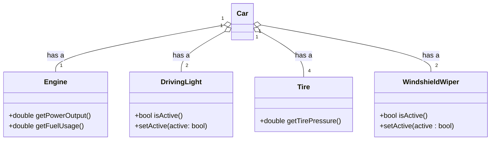
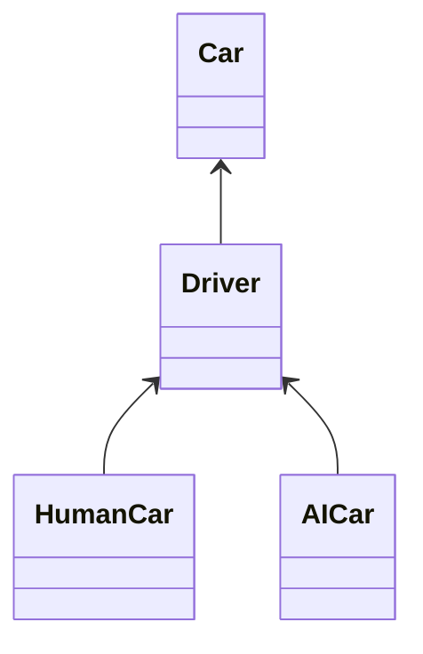
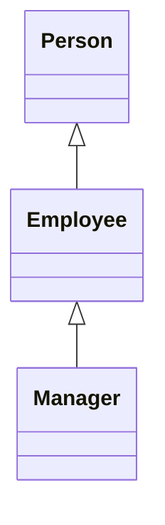
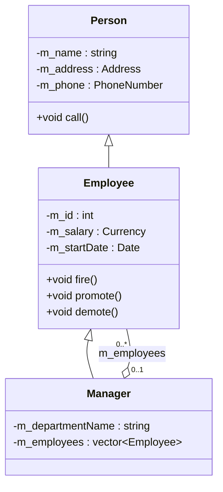

## Chapter 5: Designing with Objects

### EX 1

```mermaid
classDiagram
    Car "1" o-- "1" Engine : has a
    Car "1" o-- "2" DrivingLight : has a
    Car "1" o-- "4" Tire: has a
    Car "1" o-- "2" WindshieldWiper: has a
    Car
    class Car
    Engine
    class Engine{
        +double getPowerOutput()
        +double getFuelUsage()
    }
    DrivingLight
    class DrivingLight{
        +bool isActive()
        +setActive(active: bool)
    }
    Tire
    class Tire{
        +double getTirePressure()
    }
    WindshieldWiper
    class WindshieldWiper{
        +bool isActive()
        +setActive(active : bool)
    }

```

### EX 2

```mermaid
classDiagram
    Car <-- Driver
    Driver <-- HumanCar
    Driver <-- AICar
```

### EX 3

```mermaid
classDiagram
    Person <|-- Employee
    Employee <|-- Manager
```

### EX 4

```mermaid
classDiagram
    Person <|-- Employee
    Employee <|-- Manager
    Manager "0..1" o-- "0..*" Employee : m_employees
    class Person{
        -m_name : string
        -m_address : Address
        -m_phone : PhoneNumber
        +void call()
    }
    class Employee{
        -m_id : int
        -m_salary : Currency
        -m_startDate : Date
        +void fire()
        +void promote()
        +void demote()
    }
    class Manager{
        -m_departmentName : string
        -m_employees : vector~Employee~
    }
```